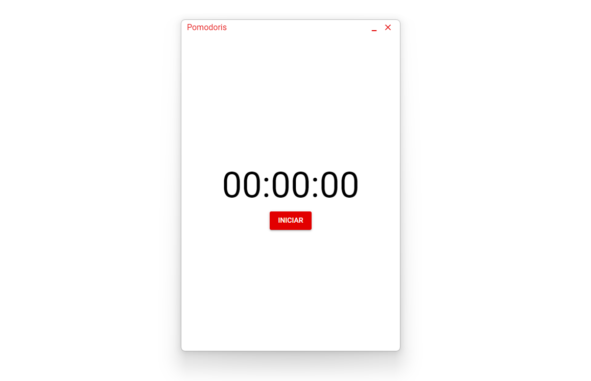

# Pomodoris

<p align="center">
  
</p>

<p align="center">
  
</p>

*O melhor contador pomodoro que o dinheiro não pode comprar!*

Este é um aplicativo básico que divide o tempo de uma hora em quatro partes com intervalos de cinco minutos, ideal para quem precisa de
disciplina para realizar determinada tarefa.

[☕️ Download para Windows x64](https://github.com/tavaresgerson/pomodoris/releases/download/v1.0.0/Pomodoris.Setup.0.0.1.exe)

### Instalação de dependências
```bash
yarn
# or
npm install
```

### Iniciar o projeto em modo de desenvolvimento
```bash
quasar dev -m electron
```


### Construir o aplicativo para produção, está definido como um aplicativo portátil
```bash
quasar build -m electron
```
